<h1 align="center">wxgrid</h1>

<p align="center"><strong>A global weather map you host yourself.</strong><br>
Eight numerical weather models, free and keyless, stored once and drawn on your own GPU.</p>

<p align="center">
<a href="LICENSE"></a>
<a href="https://www.python.org/"></a>
<a href="#data-sources"></a>
<a href="#models"></a>
<a href="https://jeffbai996.github.io/wxgrid/"></a>
</p>

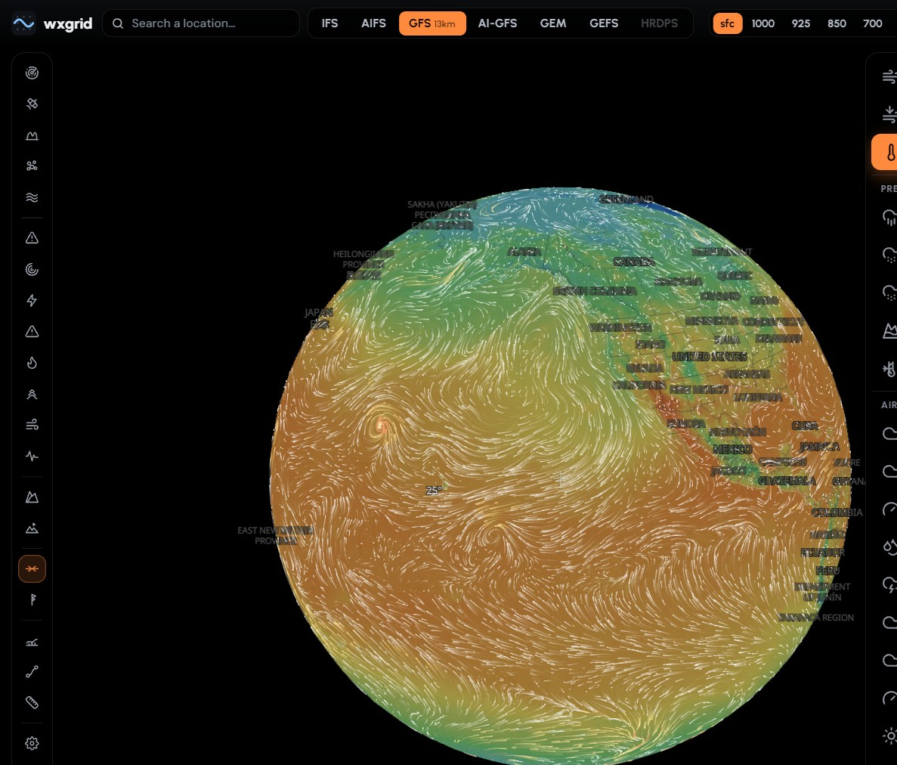

Every weather app worth using is somebody else's server, somebody else's rate
limit, and somebody else's idea of which layers you are allowed to see. The raw
model data all of them run on is free: ECMWF, NOAA and Environment Canada
publish it, keyless, several times a day. wxgrid pulls it, stores it once, and
draws it.

The whole thing is a Zarr store, a FastAPI app and a folder of static
JavaScript. No build step, no bundler, no `node_modules`. It runs on one box,
installs to a phone, and works offline on what it last loaded.

## Contents

- [Highlights](#highlights)
- [Quick start](#quick-start)
- [Architecture](#architecture)
- [Models](#models)
- [Data sources](#data-sources)
- [API](#api)
- [Deployment](#deployment)
- [Configuration](#configuration)
- [Front end](#front-end)
- [Python consumers](#python-consumers)
- [Static demo](#static-demo)
- [Development](#development)
- [Roadmap](#roadmap)
- [Changelog](#changelog)
- [Licence](#licence)

## Highlights

**Eight models on one grid.** Six global (ECMWF IFS and AIFS, NOAA GFS, AI-GFS
and GEFS mean, ECCC GEM) and two regional (ECCC HRDPS 2.5 km, NOAA HRRR 3 km),
ten pressure levels, 16 days out, all switchable while the map holds the same
valid time.

**The field, not a picture of it.** `/api/field` ships each frame as 16-bit
data on the model's own grid; the browser colours it on the GPU, mixes the two
steps the scrubber sits between, and reads the cursor value out of the same
bytes. Unit and level changes cost nothing on the wire.

**Observations on the forecast.** The Stations overlay puts every METAR in
view on the map: flight-category pins, temperature, wind with an arrow the way
the air is going, and the decoded report on tap. The check on the forecast,
where the forecast is.

**Tap anywhere.** Hero conditions, a forecast strip to 16 days, the nearest
station's actual METAR, air quality, warnings in force, a meteogram, then tabs
for aloft winds, an airgram, a Skew-T, winter, outdoors, and every model side
by side on the same valid times.

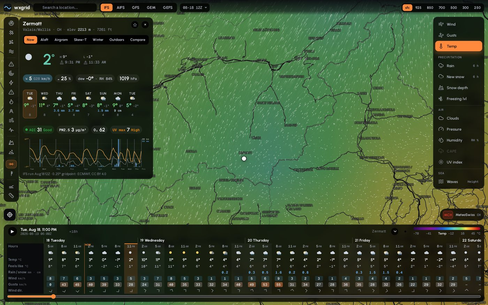

**Winter mode.** One switch turns the map into a mountain-weather workspace:
new snow, snow depth, freezing level, precipitation type, terrain and avalanche
regions, plus featured ski resorts. Pick a mountain for its elevation-band
forecast, mapped lift network, trail difficulty and grooming metadata, with a
direct hand-off to the resort's official live conditions report.

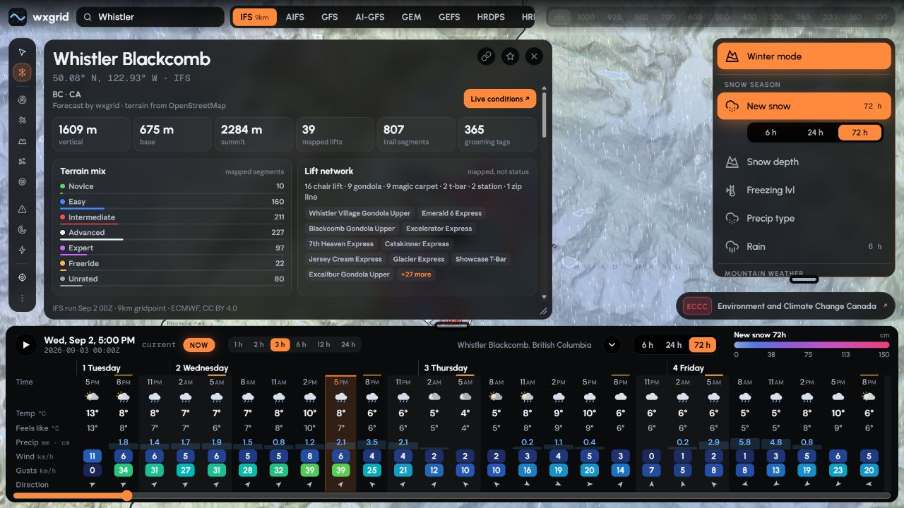

**Cross-sections.** Drag a line, get the atmosphere between the two ends:
temperature, the 0 °C line, wind barbs at every level, precipitation along the
bottom.

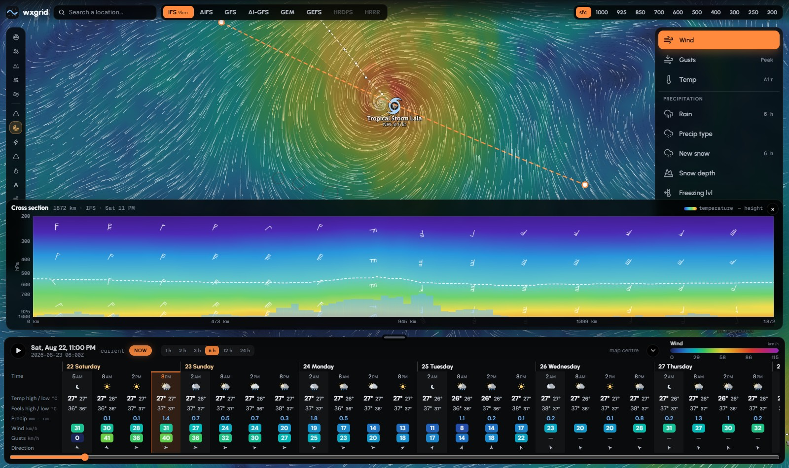

**Cyclones on the scale their ocean uses.** NHC/CPHC positions, cones and
tracks, categorised on whichever ladder applies where the storm is:
Saffir-Simpson in the Atlantic and East Pacific, typhoon and super-typhoon west
of the dateline, IMD in the North Indian, the Australian scale south of the
equator.

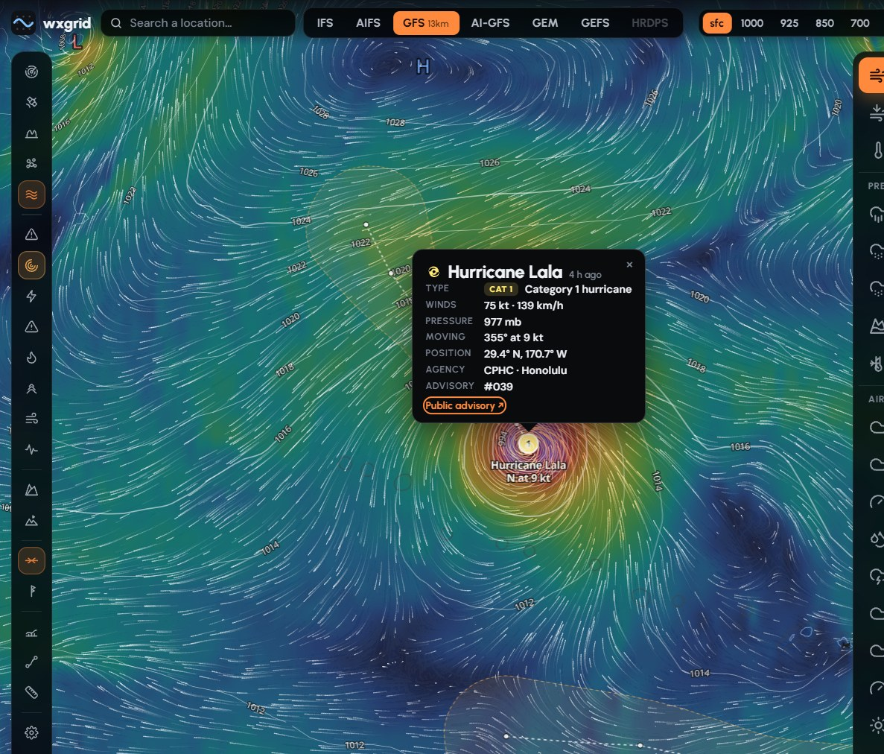

**Wildfires with the paperwork.** Active incidents and perimeters from CIFFC,
CWFIS and NIFC/WFIGS with the agency's own fire number, size, stage of control,
containment and incident page, drawn over satellite hotspots.

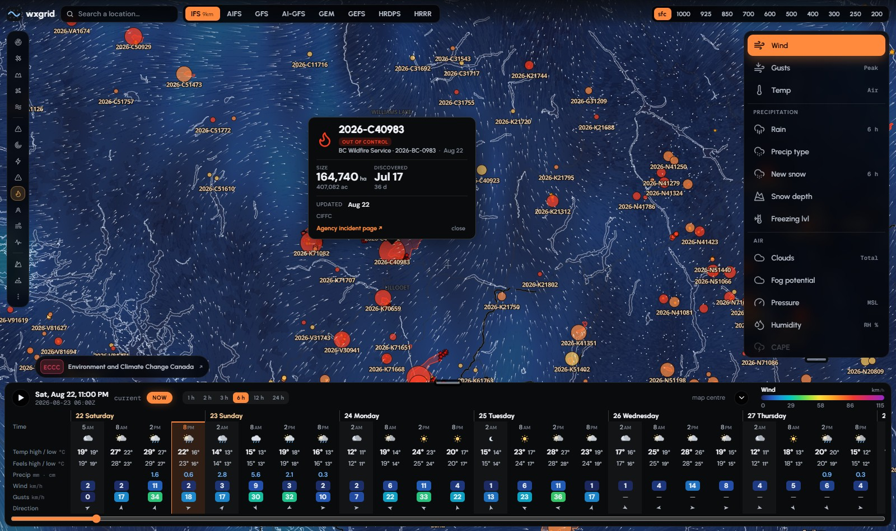

**A real sounding.** Skew-T log-P with isotherms, adiabats, mixing-ratio lines,
the parcel path, LCL and CAPE, a hodograph with the surface-to-500 hPa bulk
shear, and the nearest actual radiosonde ascent drawn over the model profile.
The balloon gives you the moisture profile the model physically cannot.

**How much to believe it.** GEFS spread as a plume: median, band, and the
honest note that the band is mean ± z·σ rather than the members themselves.

<p align="center">
  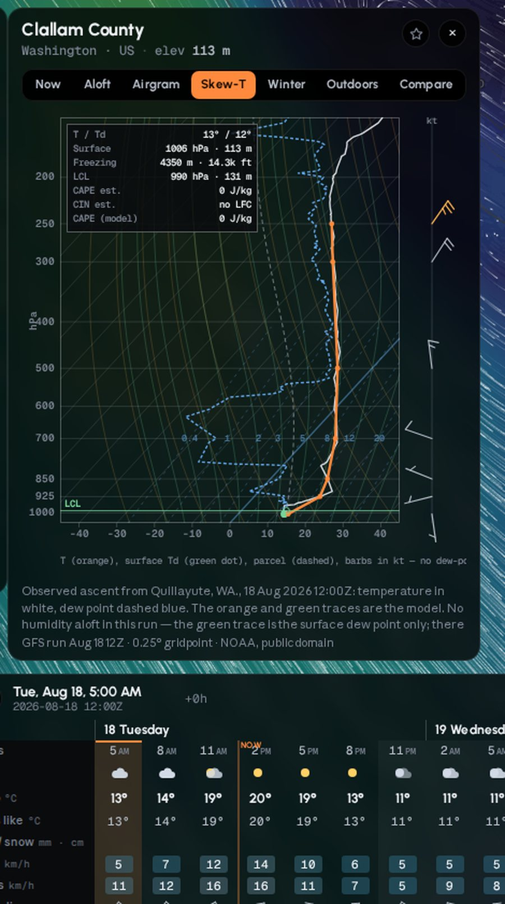
  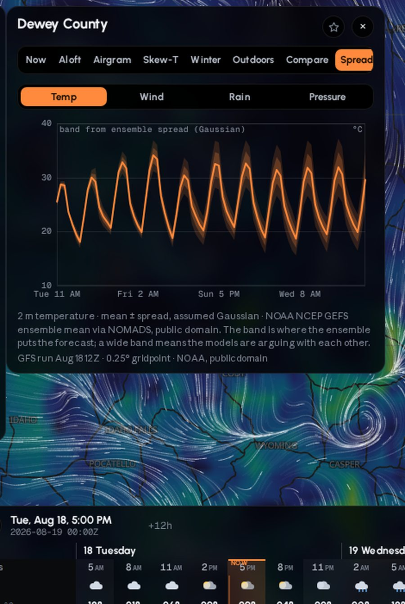
</p>

**Weather at the time you get there.** Draw a route, set a departure and a
speed, and every sample is read at its own ETA: temperature, gusts,
precipitation and type, terrain, freezing level, hazardous stretches, and any
warning polygon you cross.

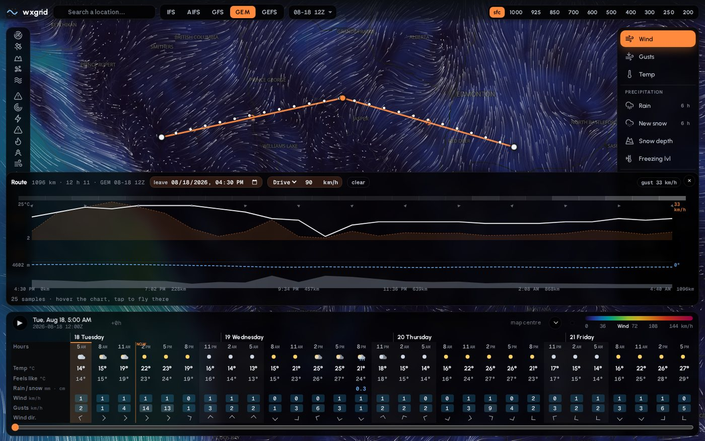

**Radar from the agency that owns the radars.** ECCC's 1 km mosaic over Canada,
NOAA MRMS over the US, RainViewer elsewhere, switching by itself as you pan.

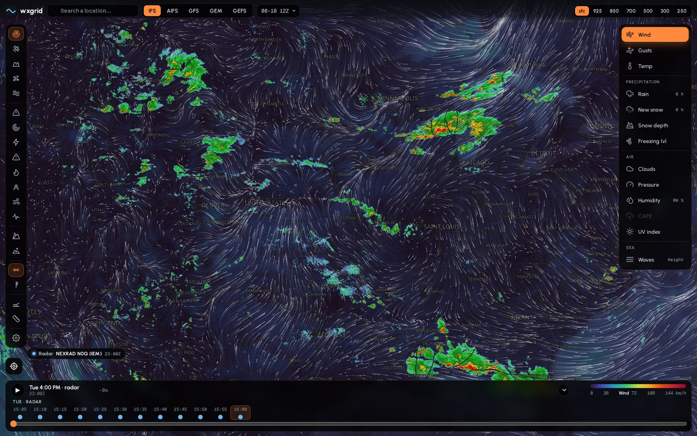

**Units are a system.** Set °F, inches, miles and inHg once and the tape, card,
legend, cursor readout and cross-section all follow. The clock runs on your
zone, UTC, or the zone of the place you are looking at.

<p>
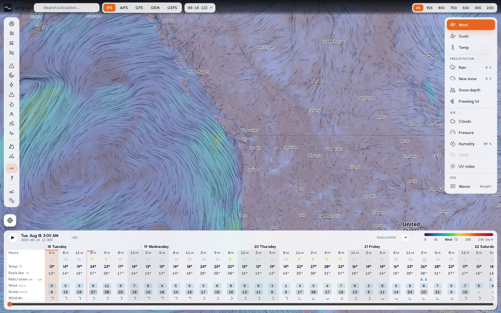
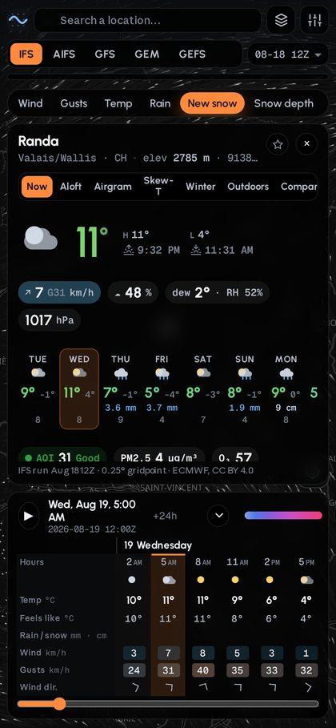
</p>

Also: isobars with H/L centres, aerosols (PM2.5, PM10, dust, AOD), GOES
satellite, aurora, official warnings from four national services, SIGMET and
AIRMET areas, earthquakes, avalanche forecasts, tides, 1,000-odd ski resorts
with elevation-band forecasts, a measure tool, saved places, permalinks, a
right-click menu (long-press on a phone), light theme, and a globe when you
zoom out.

## Quick start

Requirements: Python 3.12+, disk for the runs you keep (a global 0.25° run
with ten levels is ~6–7 GB; four are kept per model by default), and a box
that can hold a few GB in memory while a run is ingested. `eccodes` ships as a wheel;
no system packages are needed.

```bash
git clone https://github.com/jeffbai996/wxgrid && cd wxgrid
python -m venv venv && source venv/bin/activate
pip install -r requirements.txt

python -m wxgrid.ingest --model aifs      # one model, ~10 min, ~130 MB of GRIB
uvicorn wxgrid.api:app --port 8097        # http://127.0.0.1:8097/
```

`python -m wxgrid.ingest --all` fetches every model. A run already in the
store is skipped, so re-running costs one HEAD request per model.

## Architecture

```
ECMWF open data (IFS, AIFS, waves) ──────────┐
NOAA NOMADS (GFS, GEFS mean, GEFS-Aerosol) ─┤
NOAA AWS Open Data (AI-GFS, HRRR) ──────────┼─ wxgrid.ingest ─▶ data/store/<model>/<run>.zarr
ECCC MSC Datamart (GEM, HRDPS) ─────────────┘        │               (float16 + point cube)
                                                     ▼
                                              wxgrid.api (FastAPI)
                                                     │
        /api/field    one frame as 16-bit data, coloured in the browser
        /api/layer    the same frame coloured on the server (no-WebGL fallback)
        /api/wind     coarse u/v for the particle layer
        /api/point    every variable at every step, one gridpoint
        /api/xsection vertical slice between two points
        /api/route    weather along a path at the time you reach each point
        /api/ens      ensemble plumes and spread
        /api/sonde    the nearest radiosonde ascent
                                                     │
                                                     ▼
                       front/   MapLibre GL + WebGL field layer + canvas particles + the tape
```

| Path | Role |
|---|---|
| `wxgrid/fetch.py`, `wxgrid/models.py` | one fetcher per source; one `Model` entry per model (params, steps, precip convention) |
| `wxgrid/grib.py`, `wxgrid/ingest.py` | GRIB decode, regrid to the common 0.25° grid, accumulation differencing, Zarr write, point cube |
| `wxgrid/store.py`, `wxgrid/reader.py` | run layout, pruning, locks; xarray-friendly readers |
| `wxgrid/render.py`, `wxgrid/api.py` | Mercator resample, colour ramps, field encoding; the core endpoints |
| `wxgrid/ext.py`, `*_api.py` | external feeds behind a TTL cache; radar, fires, resorts, route, ensemble, sonde, SIGMET, aerosol routers |
| `wxgrid/liveness.py` | shape-asserting probes for every upstream, behind `/api/health/sources` |
| `front/` | static app: `app.js` (state, controls), `field.js` (GPU field), `panes.js` (card panes), `tape.js`, `overlays.js`, `particles.js`, `sw.js` |
| `deploy/` | systemd units and timers |
| `scripts/` | Pages publisher, post-deploy smoke test |

Every field is stored float16 against a per-field offset and scale
(temperatures as °C, pressure as Pa above 100 000, heights in 4 m units): half
the bytes of float32 with worst-case errors in the hundredths. The reader hands
back real units. After a run lands, ingest re-chunks it into a point cube
(`pt/<var>`, all steps × 24×24-gridpoint tiles) so a point series decompresses
one small chunk (~50 ms) instead of every step. Only the newest run of each
model keeps its cube; older runs still answer through the step layout.

## Models

Pressure levels are **1000 925 850 700 600 500 400 300 250 200 hPa** on 6 h
steps. A model that does not publish a level never writes it, and the API
advertises only what a run actually contains.

| key | model | source | native grid | surface steps | surface variables | aloft (u v t gh) |
|---|---|---|---|---|---|---|
| `ifs` | ECMWF IFS | ecmwf-opendata | 0.25° | 3 h to 144 h, then 6 h to 240 | u10 v10 t2m d2m msl tp sf sd gust tcc cape + waves swh mwd mwp (6 h) | all 10 levels |
| `aifs` | ECMWF AIFS (AI) | ecmwf-opendata | 0.25° | 6 h to 240 h | u10 v10 t2m d2m msl tp sf tcc | all 10 levels |
| `gfs` | NOAA GFS | NOMADS filter CGI | 0.25° | 3 h to 240 h, then 6 h to 384 | u10 v10 t2m d2m msl tp sf(derived) sd gust tcc cape | all 10 levels |
| `aigfs` | NOAA AI-GFS (AI) | AWS Open Data | 0.25° | 6 h to 384 h | u10 v10 t2m d2m msl tp | all 10 levels |
| `gem` | ECCC GEM GDPS | MSC Datamart | 0.15° → | 3 h to 240 h | u10 v10 t2m d2m msl tp sf sd gust tcc cape | all 10 levels |
| `gefs` | NOAA GEFS mean | NOMADS filter CGI | 0.25° / 0.5° → | 3 h to 240 h | u10 v10 t2m d2m msl tp sf(derived) sd gust tcc cape | 1000 925 850 700 500 250 200 |
| `wn2` | Google WeatherNext 2 (AI ensemble mean) | GCS Zarr (gated) | 0.25° | 6 h to 360 h | t2m u10 v10 msl tp sst | t u v gh at all 10 levels |
| `hrdps` | ECCC HRDPS | MSC Datamart | 2.5 km → 0.025° regional | hourly to 48 h | u10 v10 t2m d2m msl tp sf sd gust tcc | surface only |
| `hrrr` | NOAA HRRR | AWS Open Data | 3 km → 0.025° regional | hourly to 48 h | u10 v10 t2m d2m msl tp sf sd gust tcc | surface only |

`→` marks a source bilinearly regridded onto the common 0.25° grid
(`wxgrid.grib.regrid_to_common`, missing-value aware). Store units are K, Pa,
m/s and mm; the API converts for display. Adding a model is one entry in
`wxgrid/models.py` and, for a new source, a fetcher in `wxgrid/fetch.py`.

<details>
<summary>Per-model notes</summary>

**Precipitation.** `tp6`/`sf6` hold the amount since the previous stored step
(the names predate the 3-hourly tier). ECMWF's since-start accumulation is
differenced; GFS's published 6 h buckets are used as-is; HRRR's since-run total
is de-accumulated into the same per-step buckets. GFS has no snowfall field, so
snow is the precipitation bucket where the categorical snow flag is set.
Derived layers need no extra data: relative humidity from t2m/d2m, 24 h / 72 h
accumulations, freezing level, and wave-propagation vectors for the particles.

**HRDPS and HRRR** keep their native regional story. Each GRIB's rotated or
Lambert projection is transformed at ingest with its header CRS, then
bilinearly sampled onto a regular 0.025° subgrid (nearest for categorical
fields). Only 00/06/12/18 Z cycles are ingested, hourly through 48 h, two runs
retained. Their pickers grey out when the map centre leaves the domain, and a
pinned point outside it says so.

**GEM GDPS** comes off the Datamart as one GRIB per variable, level and step
under `/{YYYYMMDD}/WXO-DD/model_gdps/15km/{HH}/{hhh}/`. Several parameters are
outside the stock eccodes tables and decode as `unknown`, so the fetcher
encodes what it asked for in the filename and the ingest forces that name on
the message. Runs are 00 and 12 Z; the first precipitation bucket is hour 003.

**AI-GFS** is NOAA's GraphCast-lineage model. wxgrid reads its public GRIB
index on AWS and fetches only the byte ranges it stores. It publishes no cloud,
CAPE, gust, snow or snow-depth fields, so those layers are absent rather than
inferred. When a shorter physics run ends, the card's later daily outlook can
continue on AI-GFS; every continuation day is labelled `AI`.

**WeatherNext 2** is Google DeepMind's FGN ensemble (64 members, 15 days,
~2 h after init). Google gates the data behind a GCP project and a data-request
form; once approved, `WXGRID_WN2_ZARR=gs://weathernext/weathernext_2_0_0_mean/zarr`
(with `gcsfs` installed and credentials on the box) makes `wxgrid/wn2.py` read
the Zarr straight into the store, no GRIB involved. The model is `optional`:
the catalog omits it until a run exists. Historic data is CC BY 4.0; real-time
data carries Google's separate experimental terms — check them before serving
it publicly.

**GEFS** is the `geavg` ensemble-mean member. Surface comes from the 0.25°
`pgrb2s` product; pressure levels come from the 0.5° `pgrb2a` product and are
regridded. That product has no 600 hPa and ships 300/400 hPa without
temperature, so `gefs` stores seven levels. Its standard-deviation fields drive
the Spread pane, labelled Gaussian from σ, not member traces.

**IFS** also carries the ECMWF wave stream on 6 h steps: significant height,
mean direction and period, peak period, and a swell height folded at ingest
from the published 10–30 s period-band heights (root sum square). Wind sea is
derived at request time as what is left of the total in quadrature. Open data
publishes no wind-wave/swell split of its own; this is the honest substitute. Older IFS runs can pick up waves with
`python -m wxgrid.ingest --model ifs --augment-waves`; a point cube can be
rebuilt any time with `--point-cube`.

ECMWF data is CC BY 4.0 (attribute ECMWF); NOAA model data is public domain;
ECCC data is under the Environment and Climate Change Canada Data Servers
End-use Licence.
</details>

## Data sources

Everything is free and keyless. Feeds are proxied through `wxgrid/ext.py`
behind a server-side TTL cache mirrored to `data/cache/ext.json`, except those
marked *direct*, whose tiles the browser fetches itself.

| Feed | Provider | Coverage | Notes |
|---|---|---|---|
| Radar | ECCC GeoMet WMS (1 km, 6 min) · NOAA MRMS (~2 min) · RainViewer | Canada · CONUS · global | *direct* tiles; the source switches by map position; the server caches only frame lists |
| Satellite | NASA GIBS GOES-East/West GeoColor · EUMETView Meteosat MTG geocolour (0°) and IODC natural colour (45.5°E) | Americas, Pacific, Europe, Africa, Indian Ocean (no Himawari) | *direct* tiles, latest frame |
| Aurora | NOAA SWPC OVATION + planetary Kp | global | rendered to a Mercator PNG |
| Alerts | NWS · MeteoAlarm (Atom/CAP, EMMA_ID regions) · BoM (CAP-AU over anonymous FTP + AMOC districts) · Environment Canada ALERTS WMS (*direct*) | US · Europe · Australia · Canada | merged into one polygon layer and point lookup |
| Tropical cyclones | NHC/CPHC (KMZ → GeoJSON), JTWC, ATCF a-decks | global | position, cone, forecast track, basin-correct category |
| Aviation hazards | aviationweather.gov SIGMET, international SIGMET, G-AIRMET | global | polygons and point lookup |
| Observations | aviationweather.gov METAR + TAF | global | nearest station |
| Radiosondes | IEM, University of Wyoming | global | nearest ascent, indices computed here and labelled as ours |
| Air quality | NOAA GEFS-Aerosol (GOCART) PM2.5, PM10, dust, AOD · Open-Meteo (CAMS) gas phase and AQI | global | UV index is estimated from solar elevation and model cloud, not measured |
| Wildfires | CIFFC incidents · CWFIS M3 perimeters and hotspots · NIFC/WFIGS incidents and perimeters | Canada · US | agency fire numbers, stage of control, containment |
| Avalanche | Avalanche Canada · avalanche.org | Canada · US | regions, zones, current products |
| Tides | DFO · NOAA CO-OPS | Canada · US | nearest station, next highs and lows |
| Earthquakes | USGS (M2.5+, past day) | global | *direct* GeoJSON feed |
| Places | Nominatim search and reverse (1 req/s honoured) · Open-Meteo elevation | global | |
| Ski resorts | OpenStreetMap via Overpass, DEM for base/summit | global | catalog, lifts, boundary; pins coloured by 72 h forecast snowfall when a snow layer is showing |
| Climate normals | ERA5 1991–2020 daily via Open-Meteo archive (CC BY 4.0) | global | one 30-year pull per 0.25° cell, cached 30 days; "+4° vs normal" on the card |
| Rain now | Open-Meteo `minutely_15` precipitation (HRRR / ICON-D2 where they run, radar-assimilating; interpolated elsewhere) | global | one call per 0.05° cell every 5 min; an hour back, two ahead, shown only when something falls |
| Webcams | DriveBC (OGL-BC) · Windy Webcams API (keyed, optional) | BC highways · worldwide | nearest cams on the point card; Windy needs `WXGRID_WINDY_WEBCAMS_KEY` and links back to windy.com |

Attribution requirements are honoured in the interface: MeteoAlarm content is
redistributed per meteoalarm.org terms, BoM products are © Commonwealth of
Australia, and the met-service badge names whoever forecasts for the country
under the cursor.

## API

All endpoints are `GET` unless noted. Model, run, step and layer names come
from `/api/models`; layer and field images are immutable per run and cached
for a year.

| Endpoint | Returns |
|---|---|
| `/api/models` | catalog: models, runs, steps, levels, variables, colour ramps and ranges |
| `/api/field/{model}/{run}/{step}/{layer}.png` | one frame as 16-bit data on the model grid (see [Front end](#front-end)) |
| `/api/layer/{model}/{run}/{step}/{layer}.png` | the same frame coloured on the server; WebP where accepted |
| `/api/wind/{model}/{run}/{step}.json` | coarse u/v for the particle layer (`?level=`, `?field=waves`) |
| `/api/isolines/{model}/{run}/{step}/{var}.json` | isolines at the stored grid spacing, with H/L centres for pressure |
| `/api/thunder/{model}/{run}/{step}.json` | thunderstorm mask: CAPE ≥ 800 J/kg with precipitation in the bucket |
| `/api/point` | every variable at every step for one gridpoint (`lat`, `lon`, `model`, `run`) |
| `/api/card` | the point card as a streamed sequence of panes |
| `/api/profile` | the vertical profile at a point (Skew-T input) |
| `/api/xsection` | vertical slice between two points |
| `/api/discussion` | the forecast discussion pane, written from the fields |
| `/api/prob` | GEFS member probabilities at a point |
| `/api/legend/{layer}` | legend ticks in the caller's units |
| `/api/route` (`GET`, `POST`), `/api/route/thresholds` | weather along a path at each point's ETA |
| `/api/ens/plume`, `/api/ens/spread`, `/api/ens/sources` | ensemble plumes and spread |
| `/api/sonde/nearest`, `/api/sonde/station/{id}` | radiosonde ascents |
| `/api/radar/sources`, `/api/radar/aurora.{json,png}`, `/api/radar/lightning` | radar frame lists, aurora, lightning |
| `/api/cams/catalog`, `/api/cams/layer/{var}/{step}.png`, `/api/cams/point` | GEFS-Aerosol layers and point values |
| `/api/fires/layer`, `/api/fires/near` | wildfire incidents, perimeters, hotspots |
| `/api/sigmet/layer`, `/api/sigmet/point` | aviation hazard areas |
| `/api/resorts`, `/api/resorts/all`, `/api/resorts/snow`, `/api/resorts/{id}`, `POST /api/resorts/rebuild` | ski resort catalog, snow colouring, details |
| `/api/normals` | 366-slot 1991–2020 normals (high, low, mean, precip) for the cell around `lat`, `lon` |
| `/api/nowcast` | 15-minute precipitation, an hour back and two ahead, with a plain headline; 204 when the upstream is down |
| `/api/webcams` | nearest public webcams to a point (`lat`, `lon`, `n`) with distance and bearing |
| `/api/obs/layer` | METAR stations in a view (`s`, `w`, `n`, `e`) as GeoJSON; 204 when the view is too wide |
| `/api/alerts/{layer,point,detail,ec}`, `/api/avy/{layer,point}`, `/api/storms`, `/api/tides`, `/api/obs`, `/api/station`, `/api/air`, `/api/geo`, `/api/geo/reverse` | external feeds |
| `/api/health`, `/api/health/sources` | upstream reachability; liveness sweep results |
| `/healthz` | process liveness |

Every request logs one line: method, path, status, cache hit or miss, wall
time.

## Deployment

`deploy/wxgrid.service` runs the API; one ingest timer per refresh tier keeps
the store current, because the models do not age at the same rate and a slow
tier must not starve a fast one.

| Unit | Models | Cadence |
|---|---|---|
| `wxgrid.service` | API on loopback `:8097` | always on; `MemoryMax=1500M`, weighted above the ingest |
| `wxgrid-ingest-regional.timer` | HRDPS, HRRR | hourly |
| `wxgrid-ingest.timer` | AIFS, AI-GFS, GEM, GFS, IFS | every 3 h |
| `wxgrid-ingest-ensemble.timer` | GEFS | every 6 h |
| `wxgrid-cams.timer` | GEFS-Aerosol | four times daily |
| `wxgrid-pages.timer` | static demo publish | twice daily |
| `wxgrid-public.service` | second instance with `WXGRID_PUBLIC=1` | optional |

```bash
cp deploy/*.service deploy/*.timer ~/.config/systemd/user/
systemctl --user daemon-reload
systemctl --user enable --now wxgrid.service wxgrid-ingest.timer wxgrid-ingest-regional.timer wxgrid-ingest-ensemble.timer
scripts/smoke.sh http://localhost:8097      # point + layer + card, end to end
```

Each timer runs `python -m wxgrid.ingest --group {regional,global,ensemble}`.
After a run lands, the ingest pre-renders the layers a visit actually opens
(wind, temperature, gusts, rain, cloud, pressure) for every step, so those
never render on a click.

**Resources.** Ingest is memory-hungry: a run is several GB and the point cube
is written per latitude band. The units cap memory and run at idle IO
priority. A hand-run `python -m wxgrid.ingest` has no cap; on a shared box go
through `systemctl --user start wxgrid-ingest` or wrap it in
`systemd-run --user -p MemoryMax=3G --scope`. The ingest paces its own writes
and downloads (see [Configuration](#configuration)) so a run lands over
minutes rather than as one burst the API's reads queue behind. A global 0.25°
run with ten levels is ~6–7 GB including the point cube; four runs per model
are kept by default.

**Exposure.** The API binds loopback. Front it with any reverse proxy or
tunnel; `tailscale serve --https=8464 http://127.0.0.1:8097` is the one-liner.
`WXGRID_PUBLIC=1` runs an instance that never serves `front/private/`, the
place for an operator's own fonts or theme overlay.

## Configuration

Everything is an environment variable with a working default.

| Variable | Default | Purpose |
|---|---|---|
| `WXGRID_DATA_DIR` | `./data` | store, GRIB scratch and caches |
| `WXGRID_CACHE_DIR` | `$WXGRID_DATA_DIR/cache` | rendered layers, feed cache, liveness state |
| `WXGRID_HOST`, `WXGRID_PORT` | `127.0.0.1`, `8097` | API bind |
| `WXGRID_KEEP_RUNS` | `4` | runs retained per model |
| `WXGRID_PUBLIC` | unset | `1` hides `front/private/` |
| `WXGRID_WRITE_MBPS` | `60` | ingest write pacing |
| `WXGRID_DOWNLOAD_MBPS` | `20` | ingest download pacing |
| `WXGRID_WINDY_WEBCAMS_KEY` | unset | Windy Webcams API key; unset = DriveBC cams only |
| `WXGRID_WN2_ZARR` | unset | WeatherNext 2 Zarr URL (`gs://…` or a local path); unset = model not ingested |
| `WXGRID_STEP_GATE_COMMAND` | unset | optional host-pressure gate run between ingest steps; non-zero exit aborts the pass, completed downloads stay reusable |

## Front end

`front/` is static and vendored: MapLibre GL v5 on OpenFreeMap's dark style
(positron in the light theme), a custom WebGL layer for the weather field, a
2-D canvas particle layer (cambecc/earth lineage), the weather tape and
scrubber (← → keys, space to play), a model picker that keeps the valid time
when you switch, an altitude picker (surface, 1000…200 hPa), radar with its
own timeline, place search, and a tap-anywhere, resizable point card. On a
phone the card is a bottom sheet over the tape. Permalinks live in the URL
hash. Fonts are DM Sans, Urbanist and Geist Mono (OFL).

**Embedding.** `?embed=1` renders the map, legend and clock with none of the
other chrome, for an iframe on another page; the settings drawer writes the
snippet for the current view, and the wordmark in the frame opens the full app
on the same view.

Card panes: **Now** (hero, alerts, air quality, station obs, up to 16 daily
cells, meteogram), **Aloft** (winds and temperatures per level, freezing level,
cloud, CAPE, QNH, TAF), **Airgram**, **Skew-T**, **Winter** (new snow, depth,
freezing and snow level, ridge wind, rain-on-snow, avalanche), **Outdoors**
(precipitation type, 24 h rain, gusts, wind chill and humidex, dry windows,
tides, marine), **Compare** (all models on the same valid times), **Spread**,
**Resort** (elevation-band forecast and lifts).

Layers: wind, temperature, gusts, rain (6/24/72 h), new snow (6/24/72 h), snow
depth, cloud, pressure, humidity (RH or dew point), CAPE, UV index, freezing
level, waves (height, swell, wind sea, mean and peak period, power),
precipitation type, the aerosol set, and GEFS
probabilities; plus isolines, wind barbs, cross-sections and a value probe
under the cursor.

### The weather field: data to the browser, colour on the GPU

The map draws the model grid itself. `/api/field` sends one frame as a
lossless 16-bit PNG on the model's own lat/lon grid: red and green carry the
value over a fixed per-layer range, blue is 1 where the model has a value and 0
where it does not. The range, ramp and fade rule for every layer are published
in `/api/models`, so browser and server work from one table.

`front/field.js` decodes those frames, keeps the last few, and draws them
through a MapLibre custom layer: every screen pixel is projected back onto the
grid and sampled with the same cubic kernel the server used, mixed with the
next step, faded by the layer's rule and looked up in a 256-entry ramp
texture. Consequences:

- Changing units changes nothing on the wire. The ramp is in display units.
- Changing level or layer costs one frame at most, none for a decoded one.
- The timeline is continuous: the scrubber mixes the two steps it sits
  between and the clock follows; release lands on a real model step.
  Precipitation type and accumulations hold their step, because half of a
  six-hour bucket is not a quantity anyone measured.
- The cursor readout is the value the pixel was coloured from, not a colour
  guessed back into a value.

`/api/layer` serves the server-coloured PNG and is the fallback with no WebGL,
no field endpoint, or `?field=0` in the URL. One console line names which
path is live.

### Offline

`front/sw.js` precaches the app shell, reading the script list out of
`index.html` at install time, and keeps three more caches: layer, wind and
field requests cache-first (immutable per run; evicted when the run leaves
the catalog), everything else under `/api` network-first with a cached
fallback, and enough of the basemap style for MapLibre to fire `load`.
Offline you get the last data you loaded and a banner saying so.
`manifest.webmanifest` installs it to a home screen; on iOS that is Share →
Add to Home Screen.

## Python consumers

```python
from wxgrid.reader import open_run, region_mean, spread
open_run("aifs")                                          # xarray Dataset, latest run
region_mean("ifs", "tp6", lat=(38, 44), lon=(-98, -85))   # corn-belt rain per stored step
spread(["ifs", "aifs", "gfs"], "t2m", 49.3, -123.1)       # per-model + mean + range on valid time
```

Put the repo on the consumer's `PYTHONPATH` (or copy `wxgrid/reader.py`,
`store.py` and `config.py`) and point `WXGRID_DATA_DIR` at the store.

## Static demo

`scripts/publish_pages.sh` builds `dist-pages/` with `wxgrid.static_demo` (one
model, 12-hourly, coarse point tiles, prebuilt resort details) and pushes it
to `gh-pages`; `deploy/wxgrid-pages.timer` does it twice a day. The front end
detects the snapshot and answers point and profile queries from the tiles;
feeds that need a server degrade quietly.

## Development

```bash
pip install -r requirements-dev.txt
pytest -q                     # offline suite: network is blocked unless a test is marked
pytest -q -m network          # the tests that reach live upstreams
scripts/smoke.sh              # against a running instance
```

The suite covers render (Mercator, colour, field encoding, wind JSON), store
roundtrip and pruning, GRIB grid normalisation, accumulation differencing, the
API contract, external-feed parsers, liveness assertions, resorts, routes,
ensembles and the static builder. Tests use a scratch data dir; outbound
sockets are refused unless a test carries `@pytest.mark.network`, and every
test has a timeout.

Conventions: conventional commits, one logical change per commit, comments
explain why. `python -m wxgrid.liveness` runs the upstream probes by hand.

## Roadmap

- WeatherNext 2 member spread into the Spread pane (the adapter ingests the
  mean today; members need the full dataset). AIFS-ENS member columns for
  true plumes.
- ICON (needs icosahedral regrid weights), hourly GFS surface tier, GFS waves
  (WW3).
- Self-hosted AI model via ECMWF `ai-models` (Aurora / GraphCast-small).

## Changelog

Short version; the commit log is the long one.

- **2026-09-01** — station observations (METAR) as a map overlay. Embed mode and
  the iframe snippet. Hodograph on the Skew-T. Meteosat discs in the satellite
  overlay. Swell, wind sea and peak period wave layers. Test suite offline by
  default with a socket guard and per-test timeout; orphaned GRIB scratch swept.
- **2026-08-25** — the map draws the model field instead of a picture of it:
  `/api/field` ships 16-bit data, the browser colours it on the GPU, the
  timeline mixes the two steps it sits between. `/api/layer` stays as the
  fallback.
- **2026-08-22** — the store halves: float16 with stored offsets; the ingest
  paces its writes and downloads and reads each variable once for the point
  cube.
- **2026-08-21** — the globe (MapLibre v5). HRDPS and HRRR as real regional
  models. Basin-correct cyclone categories. H/L centres on the isobars.
- **2026-08-20** — forecast discussion pane. GEFS member probabilities as map
  layers. Basemaps, pinned value flag, town values on the layer.
- **2026-08-19** — one-bundle front end, streamed point card, service worker
  rework, pressure-level ladder everywhere, light theme, ensemble probe.
- **earlier** — the store, the six global models, the card and its panes, the
  tape, radar/satellite/alerts/fires/aerosols overlays, Skew-T + sondes,
  routes, cross-sections, resorts, the static demo.

## Licence

Copyright © 2026 Jeff Bai. wxgrid is free software under the **GNU Affero
General Public License, version 3 or later**; see `LICENSE`.

AGPL rather than a permissive licence for the reason in the first paragraph:
the point of wxgrid is not being on somebody else's server. If you run a
modified copy as a network service, the AGPL requires you to offer your users
its source. Running it unmodified for yourself, your family or your employer
carries no such obligation.

Bundled third-party work keeps its own licence and notices:
`front/vendor/maplibre-gl.js` (BSD-3-Clause), the typefaces in `front/fonts/`
(SIL OFL 1.1, see `front/fonts/LICENSES.md`), and the Natural Earth polygons in
`data/countries.json` (public domain). Model data belongs to the producing
agency and is credited per model in the interface. Releases up to and
including `826f5db` were published under the MIT licence and remain available
under it.
