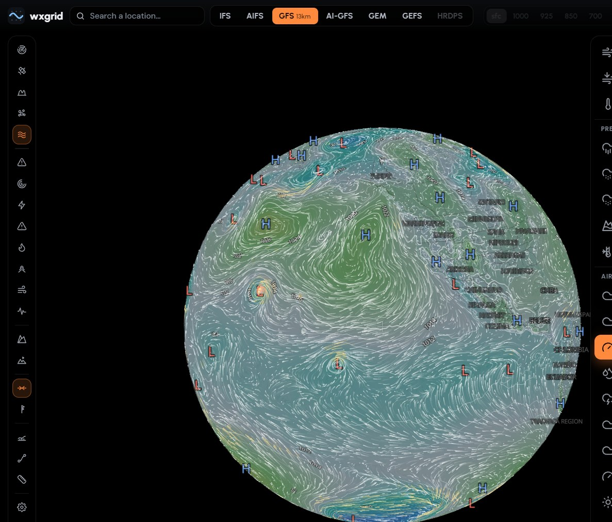
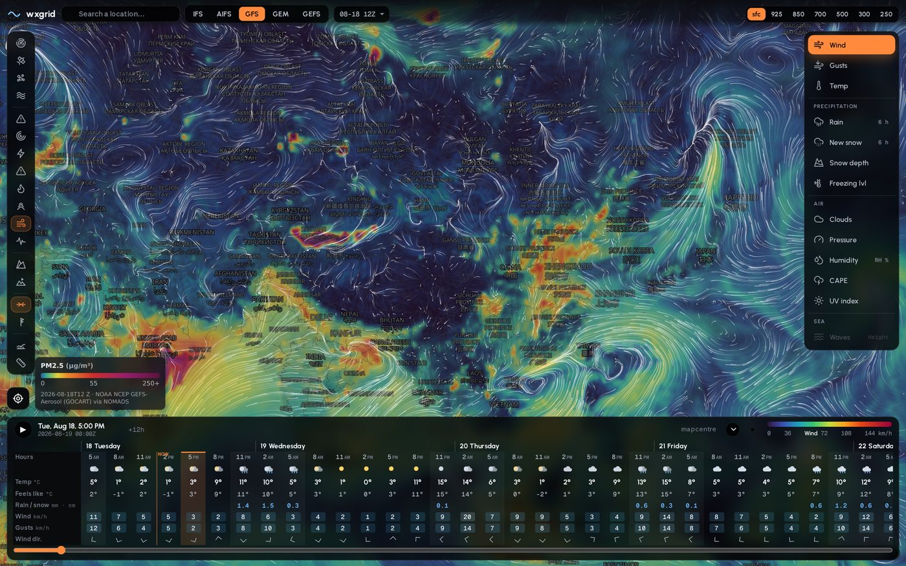
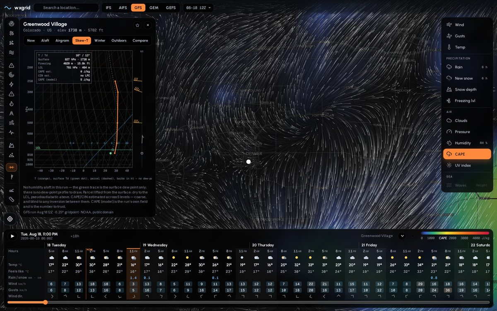
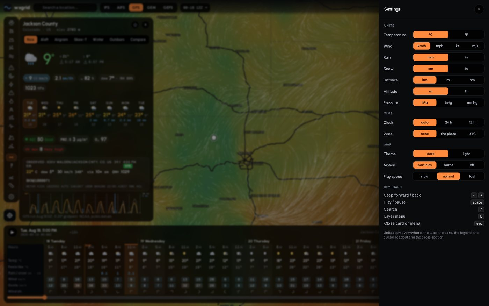
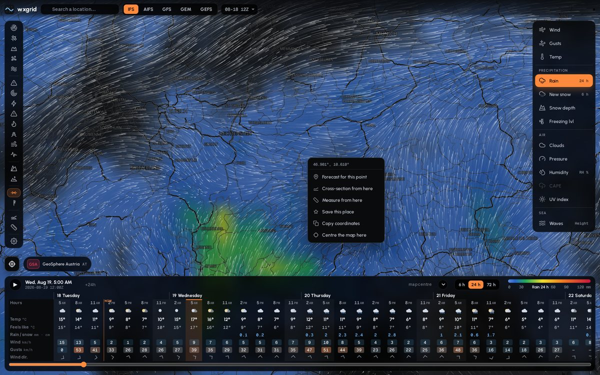

# wxgrid

**A global weather map you host yourself.** Free model data, no API keys, AGPL-3.0.

[](LICENSE)
[](https://www.python.org/)
[](#overlays-and-external-feeds)
[](#models)
[](https://jeffbai996.github.io/wxgrid/)


Every weather app worth using is somebody else's server, somebody else's rate
limit, and somebody else's idea of which layers you are allowed to see. The raw
model data all of them run on is free — ECMWF, NOAA and Environment Canada
publish it, keyless, several times a day. wxgrid pulls it, stores it once, and
draws it.

Six global and two regional models, ten pressure levels, particles, agency
radar, warnings from four national services, tropical cyclones graded on the
right scale for their basin, wildfires with the incident records attached,
aerosols, cross-sections, soundings against real balloon ascents, ensemble
spread, and a forecast along a route at the time you would arrive. Zoom out
far enough and the map is a globe. Runs on one box, installs to a phone, works
offline on what it last loaded. The whole thing is a Zarr store, a FastAPI app
and a folder of static JavaScript — no build step, no bundler, no
node_modules.

```
ECMWF open data (IFS, AIFS, waves) ──────────┐
NOAA NOMADS (GFS, GEFS mean, GEFS-Aerosol) ─┤
NOAA AWS Open Data (AI-GFS, HRRR) ──────────┼─ wxgrid.ingest ─▶ data/store/<model>/<run>.zarr
ECCC dd.weather.gc.ca (GEM GDPS, HRDPS) ────┘        (GRIB2 → each model's regular lat/lon grid → Zarr,
                                              one step per chunk,
                                              plus a point cube for fast column reads)
                                             │
              ┌──────────────────────────────┴──────────────────────────┐
     wxgrid.api (FastAPI :8097)                                 wxgrid.reader (xarray)
     /api/field      the model grid as 16-bit data, coloured in     open_run · series · region_mean · spread
                     the browser
     /api/layer      the same frame coloured on the server, for
                     clients without WebGL
     /api/wind       coarse u/v for the particle layer
     /api/point      every variable at every step, one gridpoint
     /api/xsection   vertical slice between two points
     /api/route      weather along a path at the time you reach each point
     /api/ens        ensemble plumes and spread
     /api/sonde      the nearest radiosonde ascent
     front/          MapLibre + canvas particles + the weather tape
```

## What's inside

**Tap anywhere.** Hero conditions, a scrollable forecast strip out to 16 days,
the nearest station's actual METAR, air quality, warnings in force, and a
meteogram — then tabs for aloft winds, an airgram, a Skew-T, winter, outdoors,
and every model side by side on the same valid times. When a shorter
physics-model run ends, the extra days are labelled AI-GFS and switch to that
model when selected. Pin within reach of a tropical cyclone and the wind box
names it, with its category and range; tapping it flies you to the eye.


**Cross-sections.** Drag a line, get the atmosphere between the two ends:
temperature field, the 0 °C line, wind barbs at every level, precipitation
along the bottom. This is what the ten pressure levels are for.


**Wildfires with the paperwork.** Not just satellite hotspots — active
incidents and perimeters from CIFFC, CWFIS and NIFC/WFIGS, with the agency's
own fire number, size in hectares, stage of control, containment and a link
to their incident page.


**Cyclones on the scale their ocean uses.** NHC/CPHC positions, cones and
forecast tracks — with the category worked out on whichever ladder applies
where the storm actually is: Saffir-Simpson in the Atlantic and East Pacific,
typhoon and super-typhoon west of the dateline, IMD's ladder in the North
Indian, the Australian scale south of the equator. The number sits inside the
eye on the map; the card carries type, winds, pressure, motion, position and
the desk that's tracking it.


**Isobars with their centres.** Pressure charts mark every H and L worth the
name — a centre has to be the extremum of its ~15° neighbourhood and far
enough from 1013 hPa to be a system, not a col.



**Aerosols, globally.** PM2.5, PM10, dust and optical depth from NOAA's
GEFS-Aerosol at 0.25° — the Saharan dust belt and every smoke plume from every
fire on the map above.



**A real sounding.** Skew-T log-P with isotherms, dry and moist adiabats,
mixing-ratio lines, the parcel path, LCL, and CAPE both estimated from the
profile and as the model reports it. It tells you which number to trust.



**The balloon, not just the model.** The Skew-T also draws the nearest real
radiosonde ascent — white for its temperature, dashed blue for its dew point.
Our runs carry no humidity aloft, so that dashed line is a moisture profile the
model physically cannot give you.

**How much to believe it.** GEFS publishes the ensemble standard deviation, so
the card can show a plume: median line, band, and the honest note that the band
is mean ± z·σ rather than the members themselves. A wide band is the ensemble
telling you it does not know.

<p align="center">
  
  
</p>

**Weather at the time you get there.** Draw a path, set a departure and a
speed, and every sample is read at its own ETA — temperature, gusts,
precipitation and type, the terrain underneath and the freezing level over it,
with the hazardous stretches marked and any warning polygon you cross named.


**The valley-scale check.** HRDPS over Canada and HRRR over CONUS are full
regional models, not point-only cameos: hourly 2.5/3 km layers, particles,
card, tape and Compare rows. Their pickers gray out when the map centre leaves
the advertised domain, and a pinned point outside it says so instead of
returning a tasteful arrangement of NaNs.

**Radar from the agency that owns the radars.** ECCC's 1 km mosaic over Canada,
NOAA MRMS over the US, RainViewer everywhere else — and it changes source by
itself as you pan across the border, with a badge naming whichever one you are
looking at. Individual cells, not a smoothed global composite.


**Units are a system.** Set °F, inches, miles and inHg once and the tape, the
card, the legend, the cursor readout and the cross-section all change together.
The clock can run on your zone, on UTC, or on the zone of the place you are
looking at.



**Right-click anything.** Forecast here, cross-section from here, measure from
here, save it, copy the coordinates. Long-press does the same on a phone.



**Light theme, and a phone that isn't an afterthought.** Same layers, same
overlays, same card.

<p>


</p>

Also in there: live radar with its own timeline, GOES satellite, isolines
traced at the stored grid's full 0.25° spacing (2 hPa isobars, with no invented
sub-grid detail),
official warnings from NWS / Environment Canada / MeteoAlarm / BoM, tropical
cyclones from the NHC, SIGMET and AIRMET hazard areas, earthquakes, avalanche
forecasts, 1,000-odd ski resorts with lifts and elevation-band forecasts,
tides, a measure tool, saved places, permalinks, and a value readout under the
cursor that costs no extra request — it reads the layer image the map is
already showing.

## Models

Pressure levels are **1000 925 850 700 600 500 400 300 250 200 hPa**, fetched
on 6 h steps. A model that does not publish one of them simply never writes it;
the API advertises only the levels a run actually contains, so runs ingested
against an older level set keep working.

| key  | model            | source            | native grid | surface steps                 | surface variables                                    | aloft (u v t gh) |
|------|------------------|-------------------|-------------|-------------------------------|------------------------------------------------------|------------------|
| ifs  | ECMWF IFS        | ecmwf-opendata    | 0.25°       | 3 h to 144 h, then 6 h to 240 | u10 v10 t2m d2m msl tp sf sd gust tcc cape + waves swh mwd mwp (6 h) | all 10 levels |
| aifs | ECMWF AIFS (AI)  | ecmwf-opendata    | 0.25°       | 6 h to 240 h                  | u10 v10 t2m d2m msl tp sf tcc                        | all 10 levels |
| gfs  | NOAA GFS         | NOMADS filter CGI | 0.25°       | 3 h to 240 h, then 6 h to 384 | u10 v10 t2m d2m msl tp sf(derived) sd gust tcc cape  | all 10 levels |
| aigfs | NOAA AI-GFS (AI) | AWS Open Data    | 0.25°       | 6 h to 384 h                  | u10 v10 t2m d2m msl tp                               | all 10 levels |
| gem  | ECCC GEM GDPS    | MSC datamart      | 0.15° →     | 3 h to 240 h                  | u10 v10 t2m d2m msl tp sf sd gust tcc cape           | all 10 levels |
| gefs | NOAA GEFS mean   | NOMADS filter CGI | 0.25° / 0.5° → | 3 h to 240 h               | u10 v10 t2m d2m msl tp sf(derived) sd gust tcc cape  | 1000 925 850 700 500 250 200 |
| hrdps | ECCC HRDPS      | MSC datamart      | 2.5 km → 0.025° regional | hourly to 48 h       | u10 v10 t2m d2m msl tp sf sd gust tcc                | surface only |
| hrrr | NOAA HRRR         | AWS Open Data     | 3 km → 0.025° regional | hourly to 48 h         | u10 v10 t2m d2m msl tp sf sd gust tcc                | surface only |

`→` marks a source that is bilinearly regridded onto the common 0.25° grid
(`wxgrid.grib.regrid_to_common`, missing-value aware so a masked field like
GEM's CAPE does not lose a cell at every edge of its mask).

**HRDPS and HRRR** keep their native regional story instead of being crushed
onto the global grid. Each GRIB's rotated/Lambert projection is transformed at
ingest with its header CRS, then bilinearly sampled onto a regular 0.025°
lat/lon subgrid (nearest for categorical fields). Only 00/06/12/18 Z cycles
are ingested, hourly through 48 h, with two runs retained. HRRR precipitation
is de-accumulated from its since-run total into the same per-step buckets every
other model exposes.

**GEM GDPS** comes off the MSC datamart as one GRIB per variable, level and
step, under `/{YYYYMMDD}/WXO-DD/model_gdps/15km/{HH}/{hhh}/` — the older
`/model_gem_global/15km/…` tree with `CMC_glb_*` filenames is gone. Several GEM
parameters are outside the stock eccodes tables and decode as shortName
`unknown`, so the fetcher encodes what it asked for in the filename and the
ingest forces that name on the message. Runs are 00 and 12 Z; there is no
hour-000 accumulation file, so the first precipitation bucket is hour 003.

**AI-GFS** is NOAA's GraphCast-lineage global model. wxgrid reads its public
GRIB index on AWS and fetches only the byte ranges for the fields it stores;
the model runs every 6 h through hour 384. It does not publish the cloud, CAPE,
gust, snow or snow-depth fields used here, so those layers are absent rather
than inferred. A shorter selected model can hand only the card's later daily
outlook to AI-GFS; every continuation day is visibly labelled `AI`.

**GEFS** is the `geavg` ensemble-mean member. Surface comes from the 0.25°
`pgrb2s` product; the mean has no 0.25° pressure levels, so those come from the
0.5° `pgrb2a` product and are regridded. That product carries no 600 hPa at all
and ships 300/400 hPa without temperature, so `gefs` stores seven levels rather
than ten. Its published standard-deviation fields drive the Spread pane; the
bands are explicitly labelled Gaussian from σ, not presented as member traces.

Precipitation and snowfall are stored as the amount since the previous stored
step (`tp6`/`sf6` — the names predate the 3-hourly tier); snow depth is `sd_cm`.
Pressure-level fields are linearly filled between the 6 h steps for
point products. IFS also carries the ECMWF **wave** stream (significant
height, mean direction, mean period) on 6 h steps.

Derived layers need no extra data: relative humidity (from t2m/d2m),
24 h / 72 h rain and snow accumulations (sum of the buckets after the selected
step), freezing level, and wave-propagation vectors for the particle layer.

After a run lands, ingest re-chunks it into a **point cube** (`pt/<var>`,
all steps × 24×24-gridpoint tiles) so a point series decompresses one small
chunk instead of every step (~50 ms instead of seconds). Only the newest run
of each model keeps its cube — the app reads points from the newest run, so
a superseded run's cube was dead weight (half of every run); older runs
still answer, through the step layout. Rebuild one any time:
`python -m wxgrid.ingest --model <m> --point-cube`; older IFS runs can pick
up waves with `--augment-waves`.

All free and keyless. ECMWF data is CC BY 4.0 (attribute ECMWF); NOAA model
data is public domain. `tp6` is precipitation over the previous stored step
(usually 3 h despite the historical name): ECMWF's since-start accumulation is
differenced and GFS's published buckets are used as-is. Store units: K, Pa,
m/s, mm — the API converts for display.

Adding a model = one entry in `wxgrid/models.py` (params map + precip mode)
and, if it is a new source, a fetcher in `wxgrid/fetch.py`.

## Run it

```
python -m venv venv && source venv/bin/activate && pip install -r requirements.txt
python -m wxgrid.ingest --all            # ~10 min first time; ~130 MB GRIB per model run
uvicorn wxgrid.api:app --port 8097       # http://127.0.0.1:8097/
```

Production: `deploy/wxgrid.service` (API) plus two ingest timers, because the
models do not age at the same rate. `deploy/wxgrid-ingest-regional.timer`
fetches HRRR and HRDPS hourly, which is how often HRRR publishes;
`deploy/wxgrid-ingest.timer` fetches the globals and then the ensemble every
three hours. A run already in the store is skipped, so an occurrence with
nothing new costs one HEAD per model.

They are separate units so that a slow model cannot starve a fast one. A
single pass over all eight models takes hours, and a timer will not fire while
its own service is still running, so an hourly 3 km model sharing a pass with a
30-member ensemble refreshed once per pass at best. Tailnet: `tailscale serve --https=8464 http://127.0.0.1:8097`.
After a run lands, the ingest pre-renders the layers a visit actually opens
(wind, temperature, gusts, rain, cloud, pressure) for every step, as the exact
files the request path would write, so those never render on a click. Every
request logs one line — method, path, status, cache hit or miss, wall time —
so the next bottleneck is measured rather than guessed.

The ingest paces its own writes (`WXGRID_WRITE_MBPS`, default 60) and its
downloads (`WXGRID_DOWNLOAD_MBPS`, default 20) so a run lands over minutes
rather than as one burst the API's reads and the box's other traffic queue
behind — on a shared disk a cold point read during ingest once waited 35 s.
`IOWeight`/`IOWriteBandwidthMax` on the unit only work where the `io`
cgroup controller is delegated to the user manager (it is not, by default,
under WSL); the pacer needs nothing from the kernel.

`WXGRID_DATA_DIR` moves the store (default `./data`). Four runs per model are
kept (`WXGRID_KEEP_RUNS`). Every field is stored float16 against a per-field
offset/scale (temperatures as °C, pressure as Pa above 100 000, heights in
4 m units) — half the bytes of float32 with worst-case errors in the
hundredths; the reader hands back real units. A global 0.25° run with ten
levels is ~6–7 GB including the point cube.

`WXGRID_PUBLIC=1` (see `deploy/wxgrid-public.service`) runs a second instance
that never serves `front/private/` — the place for an operator's own fonts or
theme overlay that shouldn't leave the house. Put it behind any reverse proxy
or tunnel.

One warning about resources: ingest and the static build are memory-hungry (a
run is several GB and the point cube is written per latitude band). The
systemd units cap them and run at idle IO priority; a hand-run
`python -m wxgrid.ingest` has no cap, so on a shared box either go through
`systemctl --user start wxgrid-ingest` (or `wxgrid-ingest-regional`) or wrap it in
`systemd-run --user -p MemoryMax=3G --scope`.

## Overlays and external feeds

All free, all keyless, proxied by `wxgrid/ext.py` (server-side cache, mirrored
to `data/cache/ext.json`) unless marked *direct*:

- **Radar** — agency radar where it exists, picked by where you are looking: ECCC's 1 km mosaic (GeoMet WMS, 6 min) over Canada, NOAA MRMS (NCEP GeoServer, ~2 min) over CONUS, RainViewer's global composite everywhere else. All *direct* tiles; the server only caches the frame lists.
- **Aurora** — NOAA SWPC OVATION nowcast rendered to a Mercator PNG, with the planetary Kp index
- **Radiosondes** — the nearest launch site's latest ascent (IEM, University of Wyoming), drawn on the Skew-T with indices computed here and labelled as ours
- **Satellite** — GOES-East/West GeoColor from NASA GIBS, latest frame, *direct* tiles
- **Alerts** — NWS (US), MeteoAlarm (Europe, Atom/CAP + EMMA_ID regions; attribution required, redistribution per meteoalarm.org terms) and BoM (Australia, CAP-AU over anonymous FTP + AMOC district shapes; © Commonwealth of Australia) merged into one polygon layer and point lookup, plus Environment Canada's ALERTS WMS layer (*direct*)
- **Storms** — NHC/CPHC active tropical cyclones: position, cone, forecast track (KMZ → GeoJSON)
- **Avalanche** — Avalanche Canada (point product + regions) and avalanche.org (zones + products)
- **Observations** — nearest METAR + TAF via aviationweather.gov
- **Air quality** — NOAA GEFS-Aerosol (GOCART) PM2.5, PM10, dust and AOD as 0.25° layers; Open-Meteo (CAMS underneath) for the gas phase and AQI at a point. UV index is estimated from solar elevation and model cloud, not measured.
- **Aviation hazards** — SIGMET, international SIGMET and G-AIRMET areas from aviationweather.gov
- **Wildfires** — CIFFC (Canadian incidents, agency fire numbers and stage of control), CWFIS M3 perimeters, NIFC/WFIGS (US incidents and interagency perimeters), drawn over the CWFIS hotspot raster
- **Tides** — DFO (Canada) and NOAA CO-OPS (US) nearest station, next highs/lows
- **Places** — Nominatim search + reverse (1 req/s honoured), Open-Meteo elevation
- **Ski resorts** — OpenStreetMap via Overpass (catalog + lifts + boundary), DEM for base/summit when OSM has none; with a snow layer showing, pins are coloured by the next 72 h of forecast snowfall (`/api/resorts/snow`)
- **Private overlay** — `front/private/` (gitignored) may carry `theme.css` and `theme.js`; the latter can supply agency marks for the met-service badge (`window.WX_PRIVATE.logos`). Absent, the app shows wordmarks. `WXGRID_PUBLIC=1` never serves the directory.

## Front end

`front/` is static — `app.js` (boot, state, controls, point card shell),
`overlays.js` (radar/isolines/avalanche/resorts/alerts/storms/satellite/measure),
`tape.js` (the forecast table), `search.js`, `panes.js` (card
panes), `particles.js` (wind particles + barbs), `static-api.js` (Pages
shim). MapLibre GL (vendored) on OpenFreeMap's dark style (positron in the
light theme; dark theme is OLED black), the weather field drawn by a custom
WebGL layer (`field.js`, see below) with the server-coloured `image` source
underneath it as the fallback, a 2-D canvas particle layer above it
(cambecc/earth lineage), a resizable weather tape + scrubber (← → keys,
space to play), a model picker that keeps the *valid time* when you switch,
altitude picker for wind/temp (surface, 1000…200 hPa, with altitude or flight
level on the selection), live radar overlay with
its own timeline (RainViewer, last 2 h + nowcast), place search (Nominatim),
and a tap-anywhere, resizable point card: Now (hero, alerts, air quality,
station obs, up to 16 daily cells with a labelled AI-GFS extension, meteogram),
Aloft (winds/temps per level, freezing level, cloud, CAPE, QNH,
TAF), Airgram, Winter (new snow, snow depth, freezing/snow level, ridge wind,
rain-on-snow, avalanche forecast), Outdoors (precip type, 24 h rain, gusts,
wind chill/humidex, dry windows, tides), Compare (all models on the same valid
times), Resort (elevation-band forecast + lifts). Layers: wind, temp, gusts, rain (6/24/72 h), new
snow (6/24/72 h), snow depth, clouds, pressure, humidity (RH or dew point),
CAPE, UV index, freezing level, waves (height or period), and the aerosol set;
altitude picker for wind/temp; isolines; wind barbs; cross-sections; a value
probe under the cursor. **Units are a system, not a toggle**: °C/°F, mm/in, cm/in, km/mi/nm, m/ft,
hPa/inHg/mmHg, 12/24 h — set once in the settings drawer and the tape, card,
legend, cursor readout and cross-section all follow. The clock can run on your
zone, UTC, or **the zone of the place you are looking at**, which is what you
usually want when the place is five time zones away.

Right-click (or long-press) anywhere on the map for forecast-here,
cross-section-from-here, measure-from-here, save, copy coordinates. On a phone
the card is a bottom sheet you drag up over the tape. Permalinks live in the
URL hash and are applied when one is pasted into an open tab. Measure tool,
saved places, first-run tour. Fonts: DM Sans / Urbanist / Geist
Mono (OFL, see `front/fonts/LICENSES.md`).

### The weather field: data to the browser, colour on the GPU

The map draws the model grid itself, not a picture of it. `/api/field` sends
one frame as a lossless 16-bit PNG on the model's own lat/lon grid: the red
and green channels carry the value over a fixed per-layer range, blue is 1
where the model has a value and 0 where it does not (land under a wave field,
a step it never published). The range, the colour ramp and the fade rule for
every layer are published in `/api/models`, so the browser and the server work
from one table.

`front/field.js` decodes those frames, keeps the last few, and draws them
through a MapLibre custom layer. Every screen pixel is projected back onto the
grid and sampled there with the same cubic kernel the server used, mixed with
the next forecast step, faded by the layer's rule and looked up in a 256-entry
ramp texture. Four things follow from that:

- Changing units changes nothing on the wire. The ramp is in display units
  already, so °C to °F is a label, not a request.
- Changing level or layer costs one frame at most, and nothing at all for a
  frame already decoded.
- The timeline is continuous. Dragging the scrubber mixes the two steps it
  sits between and the clock follows; the release lands on a real model step,
  because the wind, the isobars and the tape only exist on those. Precipitation
  type and the accumulation layers hold their step: a six-hour bucket half
  mixed with the next is not a quantity anyone measured.
- The cursor readout is the value the pixel was coloured from, read out of the
  same decoded frame, instead of guessing the value back out of the colour.

Precipitation type is drawn as cells rather than a smooth surface: it is a
code, so a pixel between a rain cell and a snow cell is one or the other.

`/api/layer` still serves the server-coloured PNG and is what the map falls
back to with no WebGL, no field endpoint, or `?field=0` in the URL. The
fallback is one line in the console naming which path is live.

The met-service badge names whoever forecasts for the country under the
cursor. This build draws its own **monogram** in the service's brand colour —
their actual logos are trademarks, and an approximation of a trademark is
worse than none. An operator's private overlay can supply the real marks for
a private instance (see `front/private/`).

## Offline

`front/sw.js` precaches the app shell — reading the script list out of
`index.html` at install time, so a new module is picked up without editing a
list — and keeps three more caches: layer and wind requests cache-first (they
are immutable per run, and entries are evicted when their run leaves the
catalog), field files with them, everything else under `/api` network-first with a cached fallback,
and enough of the basemap style for MapLibre to fire `load` at all. Offline you
get the last data you loaded and a banner saying so, not a broken page.
`manifest.webmanifest` installs it to a home screen; on iOS that is Share →
Add to Home Screen, since Safari has no install prompt.

## For Python consumers

```python
from wxgrid.reader import open_run, region_mean, spread
open_run("aifs")                                          # xarray Dataset, latest run
region_mean("ifs", "tp6", lat=(38, 44), lon=(-98, -85))   # corn-belt rain per 6 h step
spread(["ifs", "aifs", "gfs"], "t2m", 49.3, -123.1)       # per-model + mean + range on valid time
```

`pip install -e ~/local-projects/wxgrid` from the consumer's venv, or copy
`wxgrid/reader.py` + `store.py` + `config.py`.

## Static demo (GitHub Pages)

`scripts/publish_pages.sh` builds `dist-pages/` with `wxgrid.static_demo`
(one model, 12-hourly, coarse point tiles, prebuilt resort details) and
force-pushes it to `gh-pages`. `deploy/wxgrid-pages.timer` does it twice a
day. The front detects the snapshot and answers point/profile queries from
the tiles; feeds that need a server (METAR, other-model compare, new resort
lifts) degrade quietly.

## Roadmap

- WeatherNext 2 (DeepMind FGN ensemble) via BigQuery once the data-request
  form clears — needs a GCP project. AIFS-ENS member columns for true plumes
  (GEFS spread ships today; the bands are Gaussian from σ, not from members).
- ICON; hourly GFS surface tier; GFS waves (WW3).
- Model split-screen; webcams (needs a keyed API).
- Self-hosted AI model via ECMWF `ai-models` (Aurora / GraphCast-small).

## Changelog

Short version; the commit log is the long one.

- **2026-08-25** — the map draws the model field instead of a picture of it:
  `/api/field` ships each frame as 16-bit data, the browser colours it on the
  GPU, and the timeline mixes the two steps it sits between. Unit and level
  switches stop costing a request; the cursor value comes out of the field
  rather than out of the colour. `/api/layer` stays as the fallback.
- **2026-08-22** — the store halves: float16 with stored offsets for every
  field; the ingest paces its writes and downloads, reads each variable once
  when building the point cube (it was thirty times), and hands decoded GRIB
  pages back to the kernel. Cyclone glyph redrawn, hero re-shot.
- **2026-08-21** — the globe (MapLibre v5, auto-flattens as you zoom in).
  HRDPS 2.5 km + HRRR 3 km as real regional models. Tropical cyclones get
  basin-correct categories, a proper card, and a chip on the point card when
  you pin nearby. H/L centres on the isobars. Wildfire and earthquake cards
  redesigned. Layers serve PNG (3× faster cold) and prefetch their
  neighbours. Bicubic value-space smoothing at 2×.
- **2026-08-20** — forecast discussion pane (the "why", written from the
  fields). GEFS member probabilities as map layers and card rows. Basemaps
  (topo/satellite/terrain), pinned value flag, town values on the layer,
  sun/precip marks on the tape, storm-aware alert cards.
- **2026-08-19** — one-bundle front end, streamed point card, service worker
  rework (network-first shell), pressure-level ladder everywhere, light theme,
  ensemble probe, health dot.
- **earlier** — the store, the six global models, the card and its panes, the
  tape, radar/satellite/alerts/fires/aerosols overlays, Skew-T + sondes,
  routes, cross-sections, resorts, the static demo.

## Tests

`pytest -q` — render (Mercator, colour, wind JSON), store roundtrip/prune,
GRIB grid normalisation, API contract (layers, levels, point, profile,
isolines), external-feed parsers (METAR pick, avalanche, NWS, KMZ), resorts,
static builder. Tests use a scratch data dir and stub every network call.

## Licence

Copyright © 2026 Jeff Bai. wxgrid is free software under the **GNU Affero
General Public License, version 3 or later** — see `LICENSE`.

AGPL rather than a permissive licence for the reason in the first paragraph of
this README: the point of wxgrid is not being on somebody else's server. If you
run a modified copy as a network service, the AGPL requires you to offer your
users its source. Running it unmodified for yourself, your family or your
employer carries no such obligation.

Bundled third-party work keeps its own licence and its notices must be kept:
`front/vendor/maplibre-gl.js` (BSD-3-Clause), the four typefaces in
`front/fonts/` (SIL OFL 1.1, see `front/fonts/LICENSES.md`), and the Natural
Earth polygons in `data/countries.json` (public domain). Model data belongs to
the producing agency and is credited per model in the interface.

Releases up to and including `826f5db` were published under the MIT licence and
remain available under it; the change applies from this commit forward.

